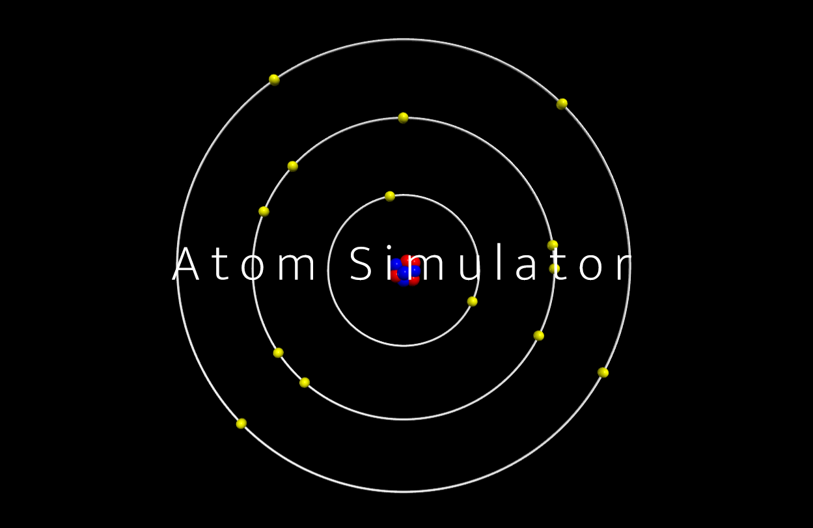

# Atom Simulator

This project allows the user to simulate the 118 known elements according to the Bohr Model.

## Features

- Animate electrons orbiting around the nucleus.
- Check the stability of any given atom.
- Give the stable isotops of any element.
- Determine the electron configuration of any element.

## Informations

- The project was built using VPython :
  - https://www.vpython.org/
- It was then converted to JavaScript :
  - https://www.webvpython.org/
- Locally :
  - You can either run the main Python file or the HTML file.
- On the web :
  - You can simply access the GitHub Page.
    - https://ahmedkerouat.github.io/atom-simulator/

### Python Requirement:

- `pip install vpython`

## Controls

- Input menus : simply click on your desired option.
- Zoom : Mouse scroll wheel / Alt + Left Mouse Button & Drag.
- Rotate : Right Mouse Button + Drag / Ctrl + Left Mouse Button & Drag.
- Move around : Shift + Left Mouse Button & Drag.
- Risize Window : Drag the icon located on the lower right side of the canvas.

## Screenshots

## Useful Resources

- https://en.wikipedia.org/wiki/Aufbau_principle
- https://en.wikipedia.org/wiki/Electron_shell
